### How to create your Dapp and deploy it to Vercel

#### Things you learn

Tabel of content Content

  - Setting up your Github and creating your project
  - Setting up Next.JS 
  - How to Write and Deploy your Smart contracts using Remix ID to the Testnets
  - How to connect your Smart contract with Next.JS using ethers.js
  - How to deploy your Dapp to Vercel

> So much to learn let's get started

#### Next.JS  Setup 
> Require
[Node.js 12.22.0](https://nodejs.org/) or later

> install yarn "do it now and thank me later"
`npm install -g yarn`

#### create Next.JS 
`yarn create next-app YOUR_APP_NAME`

at this point, you have up and running the Next.Js app

#### Github Setup

> his is how you create a new repository
pictures

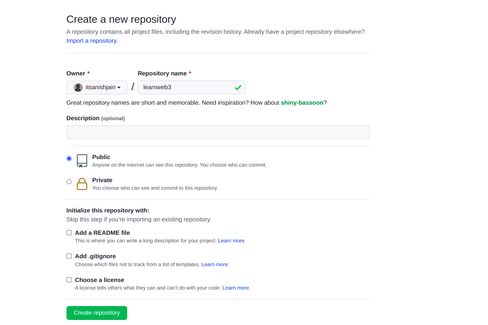

Run these commands to upload your code to GitHub

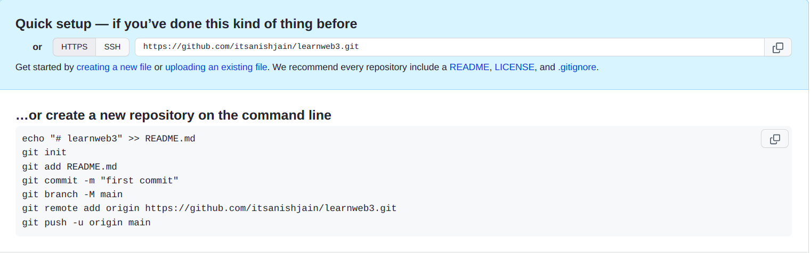

> git init 

> git add .

> git commit -m "Initial commit" 

>git branch -M main

> git remote add origin 
Your_GIT_REPO_LINK

> git push -u origin main

After pushing your code looks like this

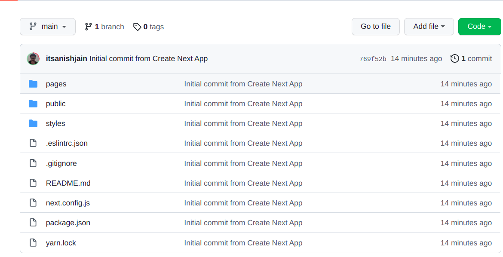

#### Vercel deploy

create an account with your GitHub

create a new project

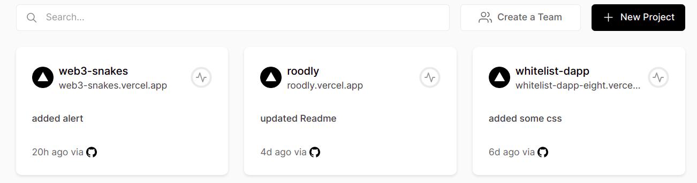

select your newly create a repository

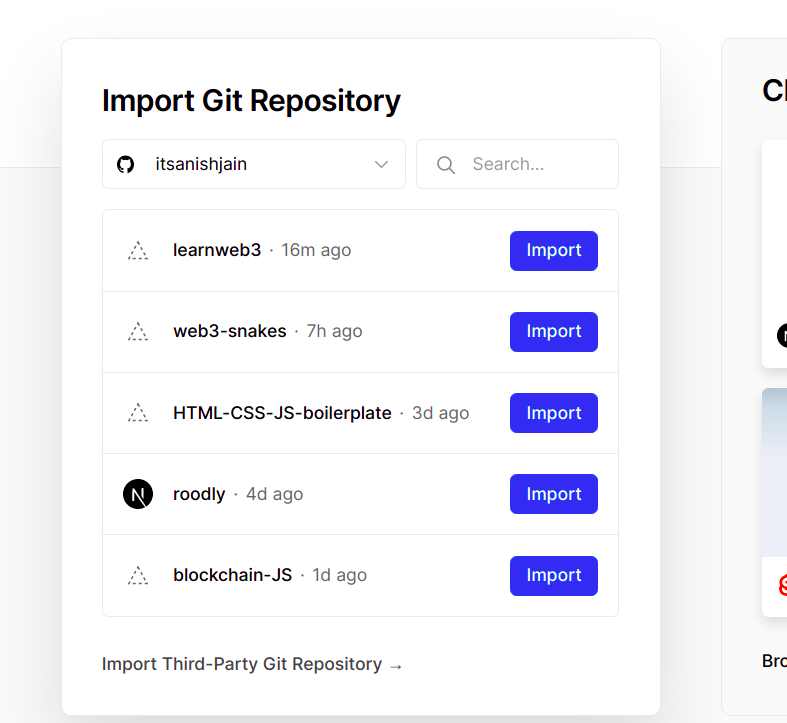

then deploy

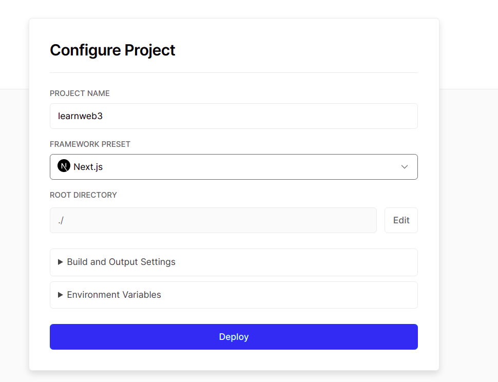

At this point hope your Next.JS app is up and running

#### deploy Smart contract to Rinkeby using remix IDE

open Remix ID

https://remix.ethereum.org/

##### go to Storage.sol file and compile it by going to SOLIDITY COMPILER

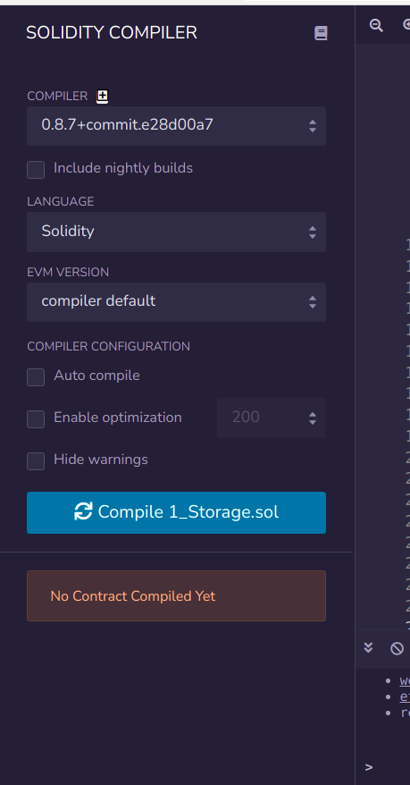

##### open your MM and select Rinkeby

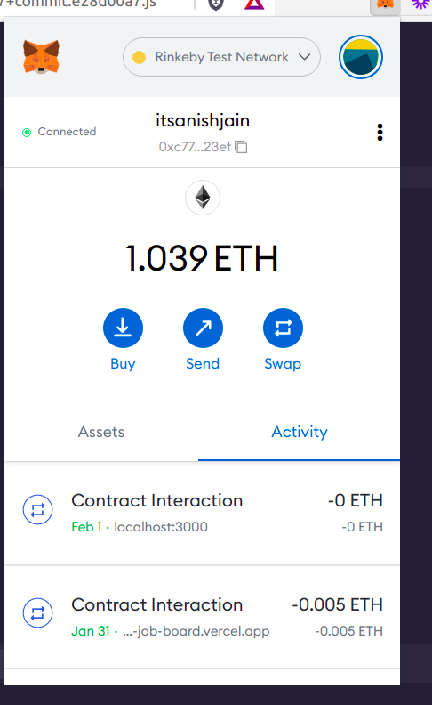

##### Go to DEPLOY & RUN TRANSACTIONS select injected web3 under ENVIRONMENT

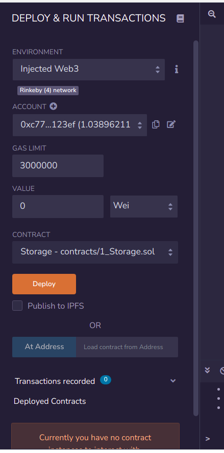

#### How to connect your Smart Contract using ethers.JS and call it from Next.JS

> Now install the ethers package, remember to install it within same folder as your Next.JS app:

`yarn add ethers`

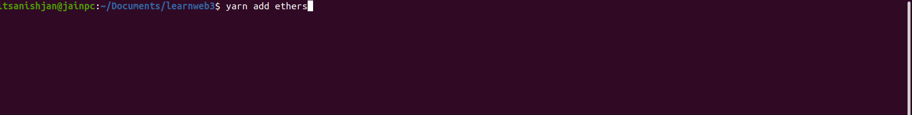

#### Now Copy the index.js from my Github

here is the source code 

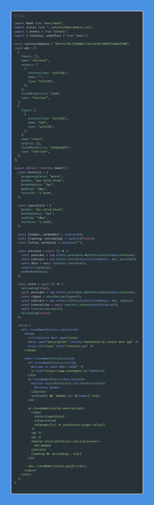

**Replace my contract address and ABI with yours** 

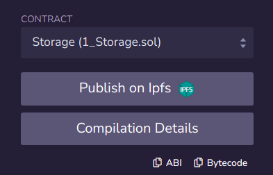

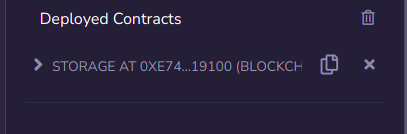

